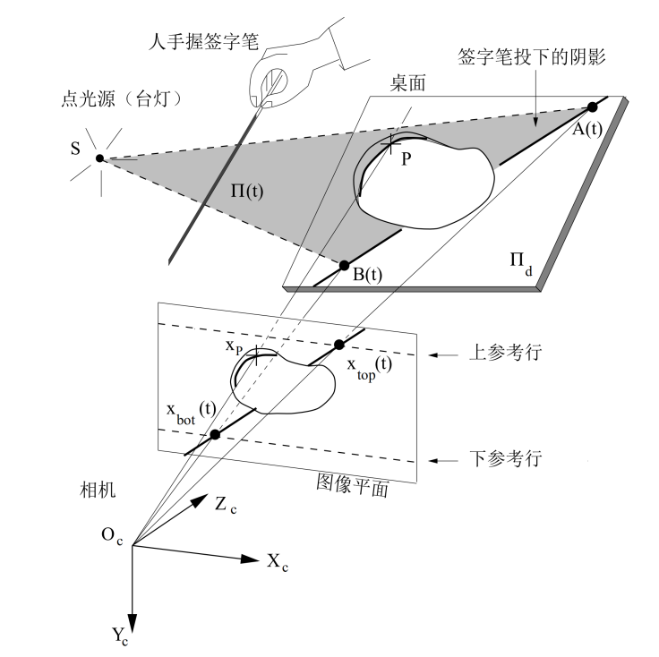
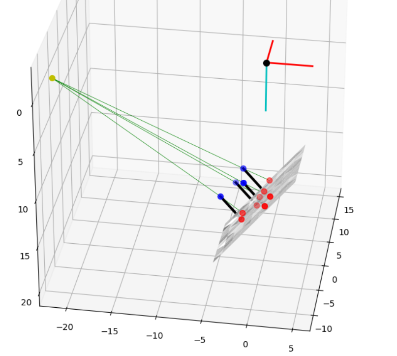
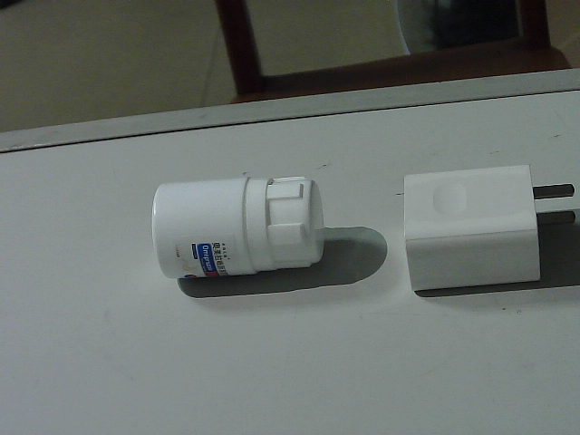
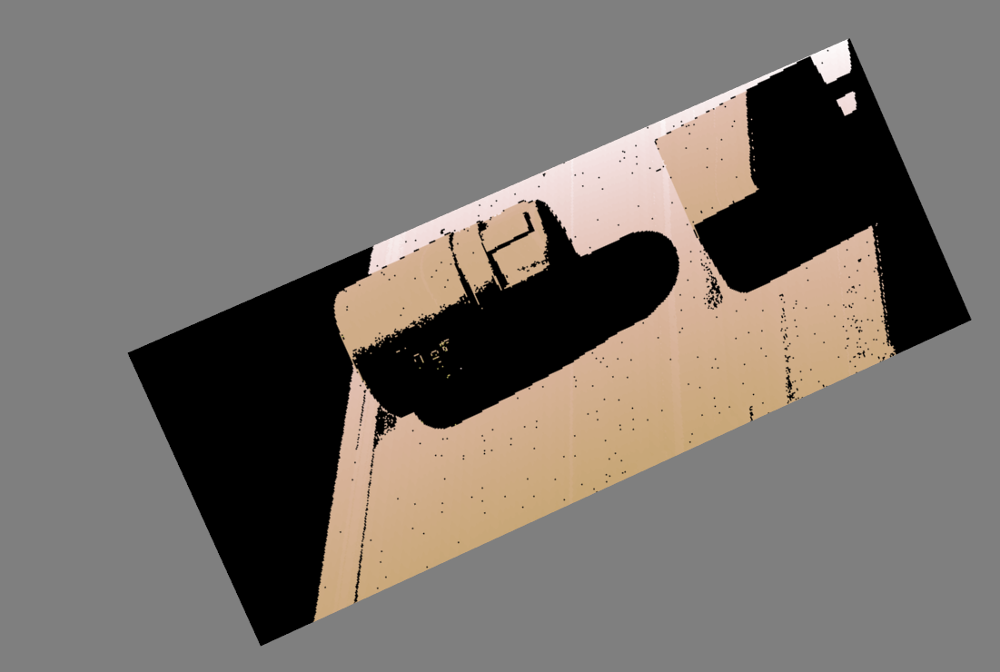

# 三维物体的表面重建

主要是复现论文：
Jean-Yves Bouguett, Pietro Peronat. 3D photography on your desk[J]. Electrical Engineering, 2007.

一种对物体表面3D重建的简单高效实现，原理图如下，详细请参考原始论文和实验报告。

 

实验结果简单展示：
<figure class="third">

</figure>

注：该项工作是计算机视觉课程作业。

